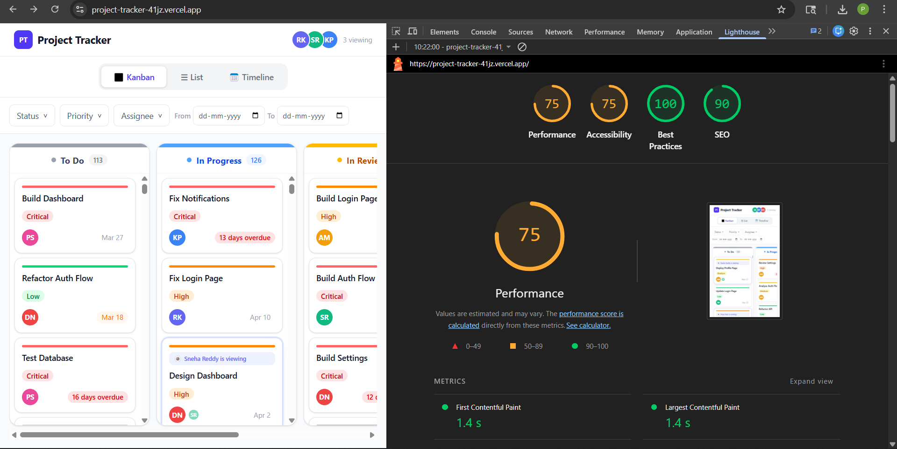

# Project Tracker

A multi-view project management app built with React + TypeScript + Tailwind CSS.

Live: [https://project-tracker-41jz.vercel.app/]
Repo: [https://github.com/preethi6379/project-tracker]

---

## Getting Started

```bash
git clone https://github.com/preethi6379/project-tracker.git
cd project-tracker
npm install
npm run dev
```

Open `http://localhost:5173`. That's it.

---

## What's Inside

Three views of the same 500-task dataset:

- **Kanban** — drag cards between columns
- **List** — sortable table, change status inline
- **Timeline** — tasks as bars across the current month

Filter by status, priority, assignee, and date range. Filters sync to the URL so you can share a filtered view and the other person sees the exact same thing.

---

## State Management — Why Zustand

Three views share the same task data. When a card is dragged to a new column in Kanban, the List and Timeline should reflect that immediately. With Context you'd need a Provider wrapping everything and either prop drilling or multiple contexts. Zustand lets any component call `useTaskStore()` and read or write directly — no wiring, no unnecessary re-renders. Tasks, filters, active view, and live presence all live in one store. It made the multi-view sync straightforward.

---

## The Hard Parts

### Drag and Drop

No libraries. Built with Pointer Events — `onPointerDown`, `onPointerMove`, `onPointerUp`.

The main challenge was smoothness. Storing cursor position in `useState` meant every mouse move triggered a React re-render, which made the ghost card lag. The fix: move the ghost card using direct DOM manipulation via `useRef`. The position updates bypass React entirely and run at full frame rate.

Drop detection works by putting a `data-status` attribute on each column div. On pointer up, `document.elementFromPoint(x, y)` finds what's under the cursor. If it has `data-status`, the card moves there. If not (dropped outside any column), nothing changes and the card stays — snap back with zero extra code.

The placeholder that holds the dragged card's space in the column is a fixed-height dashed div, same dimensions as the real card. The column layout never shifts because the space stays occupied the whole time.

---

### Virtual Scrolling

No libraries. A custom `useVirtualScroll` hook.

Only the rows visible on screen get rendered, plus a 5-row buffer above and below. Everything else is not in the DOM.

```
startIndex = Math.floor(scrollTop / rowHeight) - buffer
endIndex   = startIndex + Math.ceil(containerHeight / rowHeight) + buffer
```

The outer container is set to the full height of all 500 rows (`500 × 56px = 28,000px`) so the scrollbar looks correct. Rendered rows sit inside a div positioned absolutely at `startIndex × rowHeight` from the top, so they appear at exactly the right place. At any point only ~15 rows exist in the DOM instead of 500.

Scroll position is tracked via a native `scroll` event listener with `{ passive: true }` so it doesn't block the main thread. Container height changes are handled with a `ResizeObserver`.

---

### Timeline View

Tasks with a start date and due date render as a colored bar. Tasks with no start date render as a dot on their due date. Both are positioned absolutely:

```
left  = (startDay - 1) × DAY_WIDTH
width = (endDay - startDay + 1) × DAY_WIDTH
```

The sidebar (task names) and the timeline grid scroll together. Two refs point to each side, and when one scrolls vertically the other's `scrollTop` is set to match — keeps them in sync without any state.

---

### Live Presence

A `PresenceSimulator` class holds 3 active fake users. A `setInterval` fires every 3 seconds, picks one user at random, and moves them to a different task. Components subscribe via a callback. The store's `activeUsers` array updates, task cards check if any user's `taskId` matches theirs, and show a pulsing avatar if so. No backend, no WebSocket — just an interval and a store.

---

## Seed Data

`generateTasks(500)` in `src/utils/seedData.ts` creates 500 tasks with randomised titles, assignees (6 fixed users), priorities, statuses, and dates. About 20% of tasks have no start date to test the timeline dot case. Due dates range from 20 days in the past to 30 days ahead so there are always overdue tasks in the data.

---

## Lighthouse Score



Run on desktop, production build (`npm run build && npm run preview`).

---

## One Thing I'd Refactor

The virtual scrolling hook assumes every row is exactly 56px tall. If rows ever became variable height (expandable rows, multi-line titles), the position math breaks. I'd replace the fixed height assumption with a measured position map built from a `ResizeObserver` on each rendered row. More work, but it handles any row size correctly.
